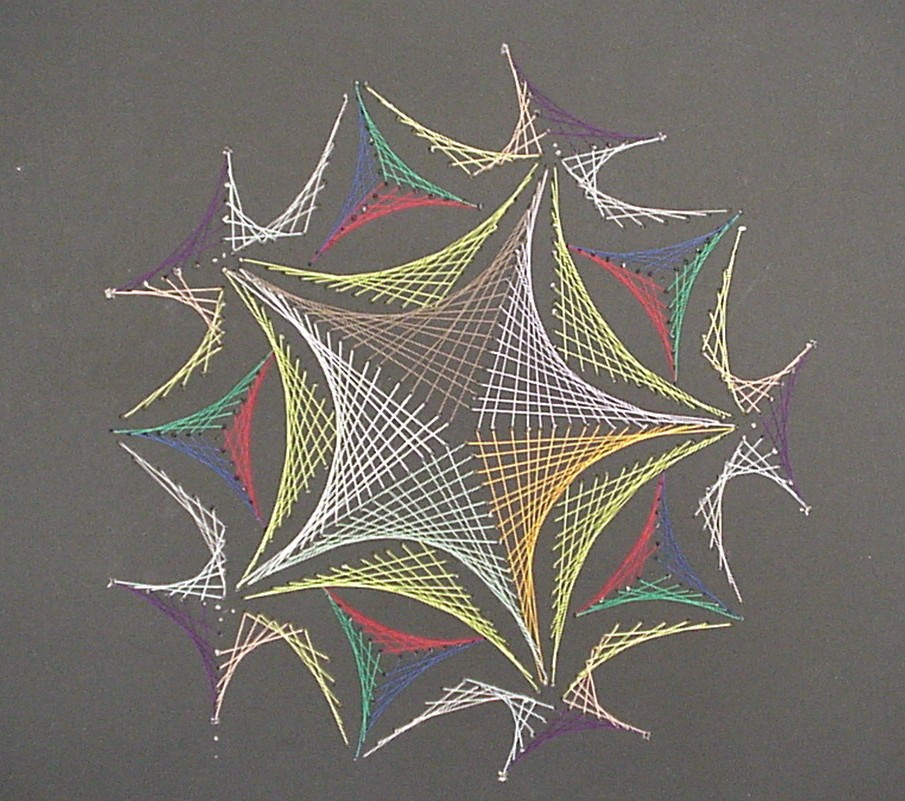

# Avoidmers

What is an avoidmer?

Avoidmers as a concept from DNA originates from a branch of computer science usually referred to as <i> stringology </i>.

Avoidmer is any k-mer that does escape the (eventually) inavoidable Zimin pattern for n=3, i.e.

$$Z_{3} = abacaba.$$

In other words, there is not a homomorphism from ${a, b, c}$ to the nucleic acid alphabet such that $Z_{3}# is homomorphically embedded
within the avoidmer. In other words, there is no factor w of k such that $f(Z_{3}) = w$, for any mapping $f$.

## Extraction

